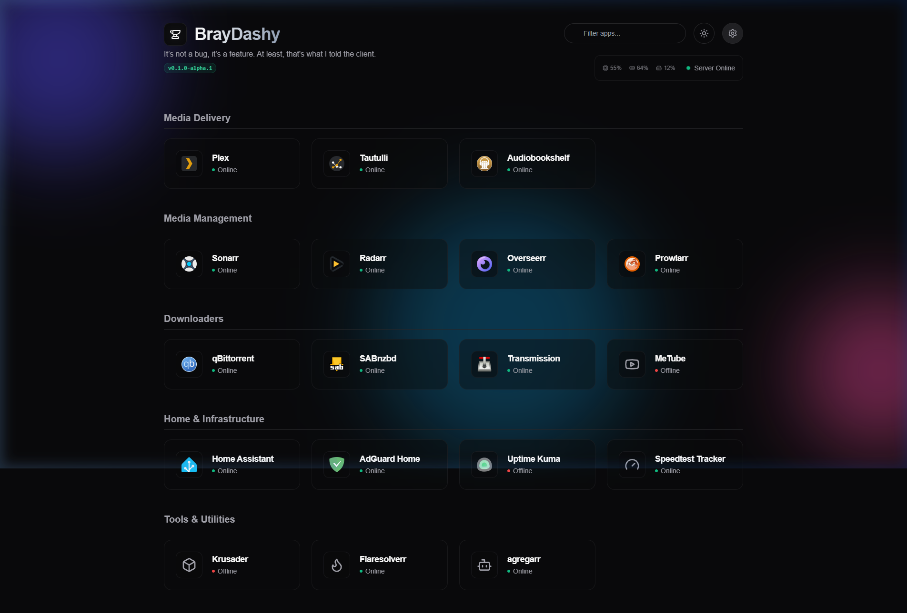

  
  <h1>BrayServer Dashboard</h1>
  
A beautifully over-engineered, React-powered, glassmorphism dashboard for your Home Server.

## 🚀 Features

*   **Dynamic React Architecture:** Built from the ground up with React, Vite, and Tailwind CSS. Snappy, responsive, and incredibly easy to modify.
*   **The Settings UI:** Say goodbye to editing `.env` files. Open the modal to add apps, rename categories, and securely store your API keys right in the browser.
*   **Persistent Configuration:** All settings are saved to a `config.json` file. Map this to an Unraid appdata volume, and your configuration survives any Docker wipe or update.
*   **Live Infrastructure Metrics:** See real-time CPU, RAM, and Disk metrics pulled directly from your server.
*   **Application Health:** The built-in Node proxy securely queries your Unraid apps (Plex, Sonarr, Radarr, Tautulli, Home Assistant) showing live reachability and key queue metrics directly on the app cards.
*   **Layout Engine:** Choose between 4 distinct header orientations (*Classic, Minimalist, Split, or Sidebar*) instantly via the Settings UI.
*   **Customization:** Change the Server Name, swap the primary logo using any `lucide-react` icon string, and enjoy an extensive list of rotating nerdy developer jokes in the subtitle.

## 🛠️ Tech Stack

*   **Frontend:** React 18, Vite, TypeScript, Tailwind CSS, shadcn/ui.
*   **Backend:** Node.js Express Proxy (Handles secure local API calls and config parsing).
*   **Icons:** Lucide React & Walkxcode Dashboard Icons.

## 🐳 Quick Start (Docker / Unraid)

This project is optimized for Unraid using a multi-stage Docker build. 

1. Use the provided `brayserver-docker-template.xml`.
2. Ensure you map the `/app/config.json` path to a persistent volume (e.g., `/mnt/user/appdata/brayserver-dashboard/config.json`) so your settings are saved permanently!
3. Access the dashboard at `http://[YOUR-IP]:3000`.

## 💻 Local Development

1. Clone the repository.
2. Install frontend dependencies: `cd frontend && npm install`
3. Install backend dependencies: `npm install`
4. Run the frontend Vite server: `cd frontend && npm run dev`
5. Run the backend proxy: `node server.js`

*Note: The frontend runs on port 5173 for HMR, but expects the Node API to be running on port 3000 to fetch metrics and save the configuration.*

---
*Created with ☕ and <3 for the r/selfhosted community.*
